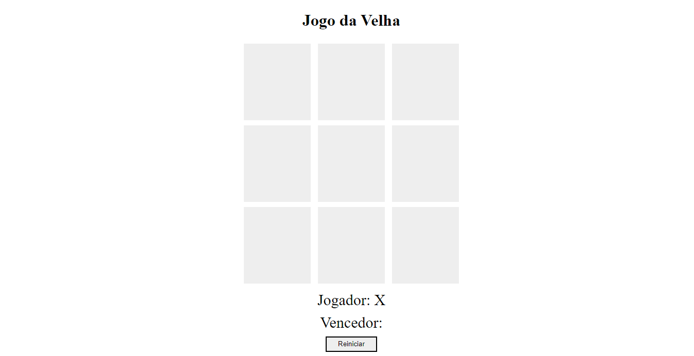

<h1 align="center" style="text-transform: uppercase">✖️ jogo da velha ⭕</h1>

<h3 align="center">jogo da velha desenvolvido no Bootcamp da DIO.</h3>

 

  

    

Acesse o projeto [aqui]()

 

## 🏵️ Tecnologias

* HTML e CSS
* Javascript
* Git e Github

 

## 📽️ Projeto

O projeto é o clássico e divertido jogo da velha e funciona do mesmo jeito que o jogo original.

 

## 📒 Licença

Esse projeto está sob a licença MIT.
